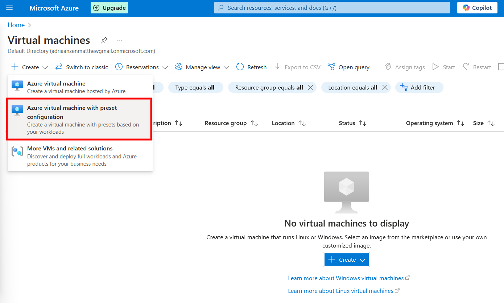
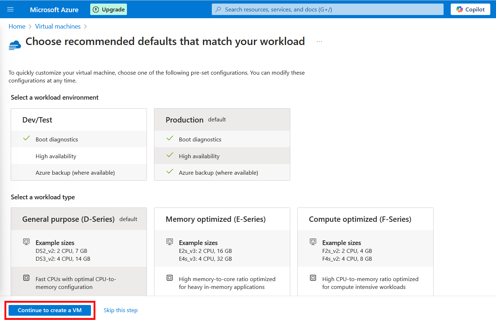
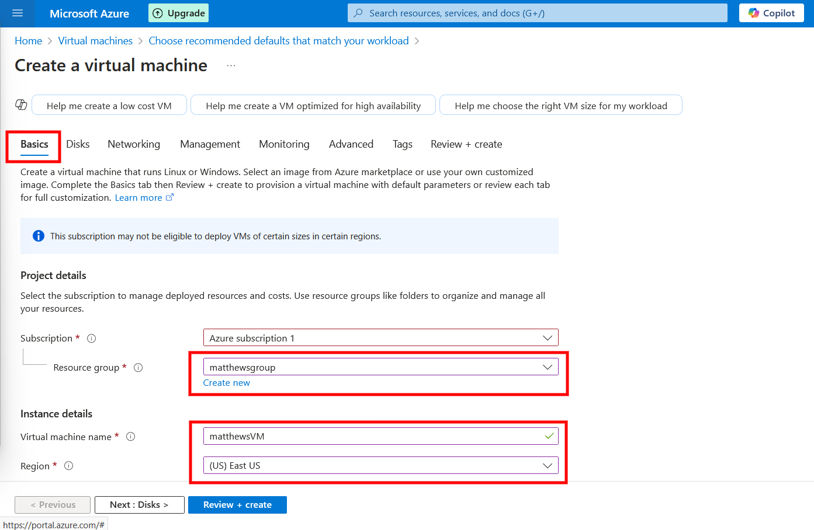
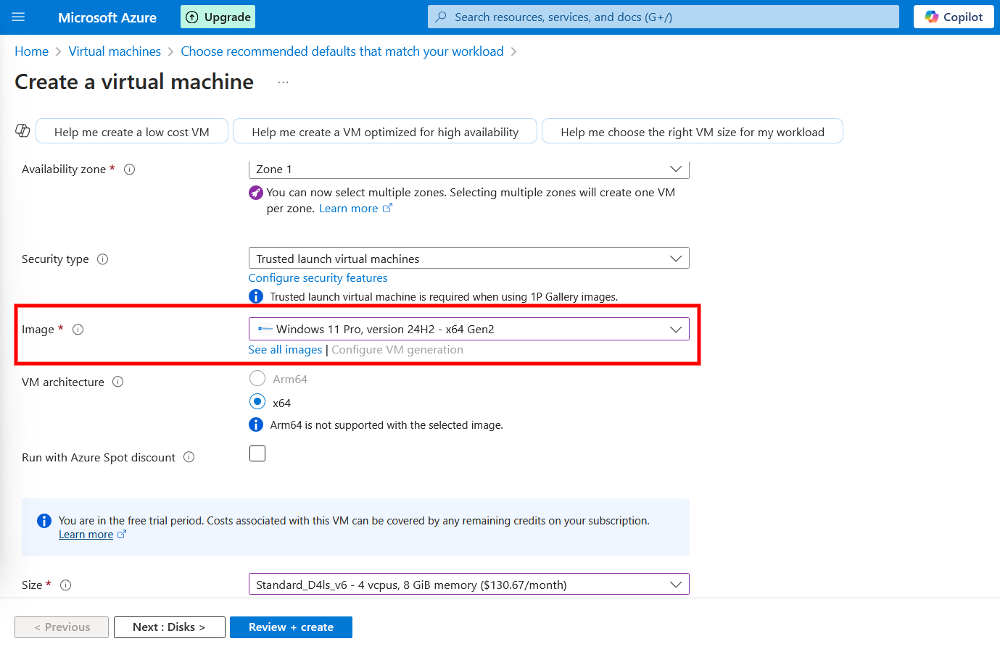

# Building a SOC Homelab with Azure Sentinel

## Introduction

In this guide, I will walk through setting up a SOC (Security Operations Center) homelab using Azure Sentinel for security monitoring. This lab will simulate real-world security analysis, incorporating Sysmon for endpoint logging and Log Analytics for data collection.

## Objectives

*  Deploy a Windows Virtual Machine (VM) on Azure

*  Install and configure Sysmon to collect logs

*  Forward logs to Azure Sentinel

*  Analyze logs using Kusto Query Language (KQL)

---------------------------------------------------------------------

## Step 1: Setting Up an Azure Virtual Machine

### 1.1 Create an Azure VM

1. Log in to the Azure Portal.

2. Go to and Select `Virtual Machines` > `Create` > `Azure virtual machine with preset configuration`

3. On the `Choose recommended defaults that match your workload` page just select `Continue to create VM` at the bottom.

4.1. Configure the following on the Basics Tab:

Every else in this 

*  Image: Windows 10 or Windows Server

*  Size: At least 2 vCPUs and 4GB RAM

*  Public IP: Enabled

4. Set up RDP access to connect to the machine.

5. Click Create and wait for deployment.
