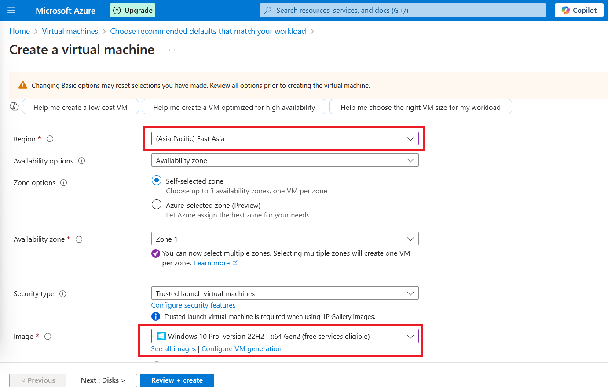
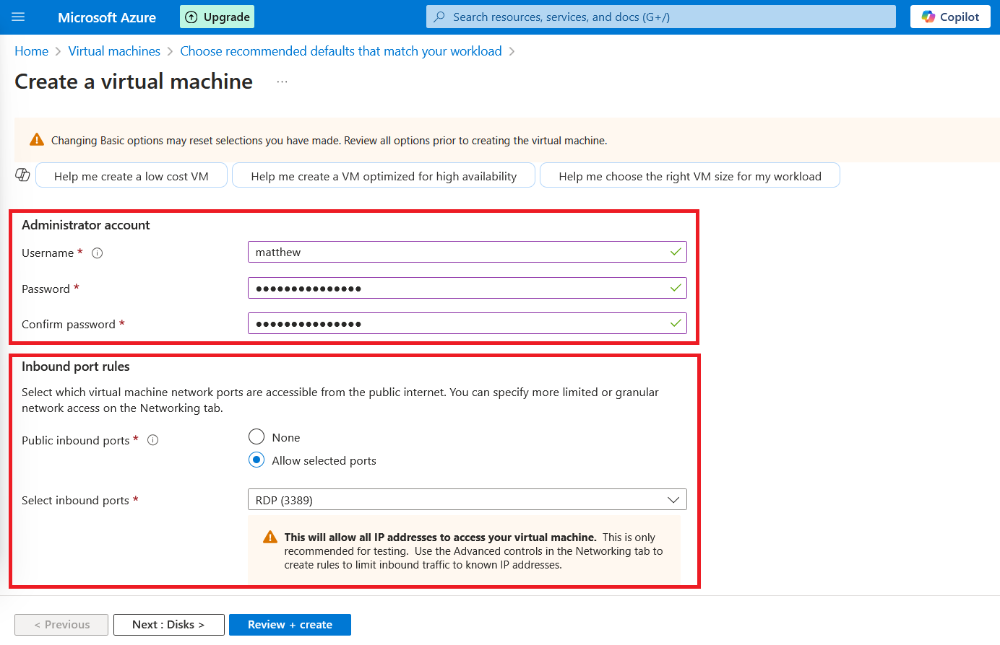
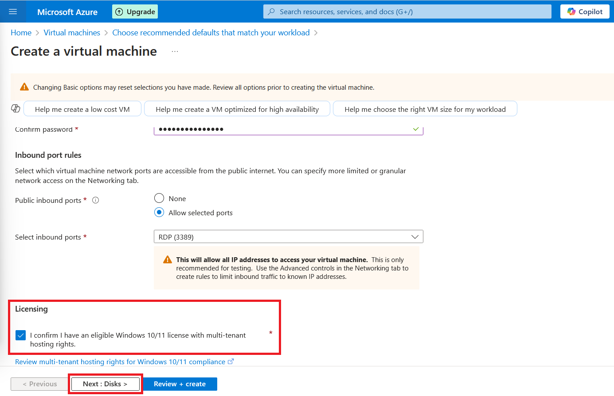
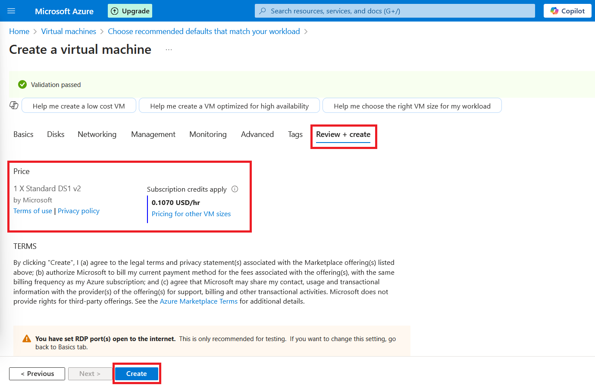

# Building a SOC Homelab with Azure Sentinel

## Introduction

In this guide, I will walk through setting up a SOC (Security Operations Center) homelab using Azure Sentinel for security monitoring. This lab will simulate real-world security analysis, incorporating Sysmon for endpoint logging and Log Analytics for data collection.

## Objectives

*  Deploy a Windows Virtual Machine (VM) on Azure

*  Install and configure Sysmon to collect logs

*  Forward logs to Azure Sentinel

*  Analyze logs using Kusto Query Language (KQL)

---------------------------------------------------------------------

## Step 1: Setting Up an Azure Virtual Machine

### 1.1 Create an Azure VM

1.1.1 Log in to the Azure Portal.

1.1.2. Go to and Select `Virtual Machines` > `Create` > `Azure virtual machine with preset configuration`

---------------------------------------------------------------------

1.1.3. On the `Choose recommended defaults that match your workload` page just select `Continue to create VM` at the bottom.

---------------------------------------------------------------------

1.1.4. Configure the following on the Basics Tab:

1.1.5. Resoure Group - this is a container that will hold all the things we'll be creating (you can name it anything).

1.1.6. VM Name - give your VM a name.

---------------------------------------------------------------------

1.1.7. Region - this is where your VM will be created.

1.1.8. Image - Select `Windows 10 Pro, version 22H2 - x64 Gen2(free services eligible)`

---------------------------------------------------------------------

1.1.9. For the Administrator Account section fill in a Username and Password.

1.1.10. Just below that make sure inbound port rules are configured as in the screenshot.

---------------------------------------------------------------------

1.1.11. Next make sure to tick the box in the Licensing part.

**Everything else on the Basics tab you can leave as default.**

1.1.12. After you followed all the above steps go ahead and click on `Next : Disks >` then `Next : Networking >` ...... (just keep clicking next until you get to the `Review + Create` tab)

_The reason why we dont just go to the_ `Review + Create` _tab right away is because the settings won't autofill unless you go onto each tab_.

---------------------------------------------------------------------

On the `Review + Create` tab here you can view the pricing of the VM.

1.1.13. Go ahead and click on `Create` at the bottom to create your VM (_Note that this process can take a couple of minutes to complete_)

---------------------------------------------------------------------

## Step 2: Setting Up Microsoft Sentinel

2.1. In the Azure Portal navigate to Microsoft Sentinel and click on Create
pic here

2.2. create new workspace
pic here

2.3. same res group and region

2.4. can skip tags tag

2.5 review and create sentinel

